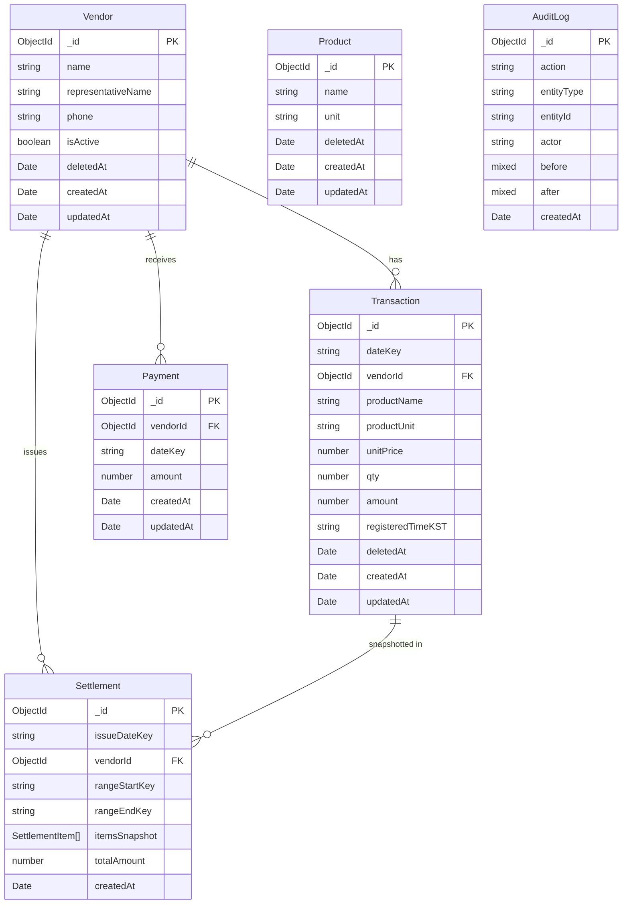

# ERD

기준: 2026-02-12

## 개요
- DB: MongoDB Atlas (Mongoose)
- 날짜 전략: `dateKey` 문자열(`YYYY-MM-DD`, KST)
- 소프트 삭제: `Vendor`, `Product`, `Transaction`의 `deletedAt`
- 거래 원장 소스: `Transaction`
- 계산서 확정본: `Settlement.itemsSnapshot` (발행 시점 스냅샷)

## ERD (Logical)

## 컬렉션 상세

### 1) Vendor
- 목적: 거래처 마스터
- 주요 필드: `name`, `representativeName`, `phone`, `isActive`
- 삭제 정책: `deletedAt` 소프트 삭제

### 2) Product
- 목적: 상품 마스터(품목/규격 추천 소스)
- 주요 필드: `name`, `unit`
- 삭제 정책: `deletedAt` 소프트 삭제
- 참고: 현재 스키마는 `vendorId`를 두지 않고 공용 상품 카탈로그로 사용

### 3) Transaction
- 목적: 장부/거래 원장(계산서 입력 포함)
- 주요 필드: `dateKey`, `vendorId`, `productName`, `productUnit`, `unitPrice`, `qty`, `amount`
- 무결성: `amount`는 서버에서 재계산(`unitPrice * qty`), 클라이언트 입력 무시
- 삭제 정책: `deletedAt` 소프트 삭제

### 4) Settlement
- 목적: 발행 정산서(스냅샷 보존)
- 주요 필드: `issueDateKey`, `vendorId`, `rangeStartKey`, `rangeEndKey`, `itemsSnapshot[]`, `totalAmount`
- 특징: 발행 시점 거래를 배열 스냅샷으로 고정 저장해 이후 원장 변경과 분리

### 5) Payment
- 목적: 거래처 입금 기록
- 주요 필드: `vendorId`, `dateKey`, `amount`
- 미수금 계산: `전체 매출(Transaction.amount 합) - 전체 입금(Payment.amount 합)`

### 6) AuditLog
- 목적: 변경 이력 추적
- 주요 필드: `action`, `entityType`, `entityId`, `before`, `after`, `createdAt`
- 현재 사용 action: `create`, `update`, `delete`, `issue`, `return`

## 인덱스

### Vendor
- `{ name: 1 }`
- `{ phone: 1 }`
- `{ isActive: 1 }`
- `{ deletedAt: 1 }`

### Product
- `{ name: 1 }`
- `{ deletedAt: 1 }`

### Transaction
- `{ dateKey: 1 }`
- `{ vendorId: 1, dateKey: 1 }`
- `{ productName: 1 }`
- `{ deletedAt: 1 }`

### Settlement
- `{ vendorId: 1, issueDateKey: 1 }`
- `{ rangeStartKey: 1, rangeEndKey: 1 }`

### Payment
- `{ vendorId: 1, dateKey: 1 }`
- `{ dateKey: 1 }`

### AuditLog
- `{ createdAt: -1 }`
- `{ entityType: 1, entityId: 1 }`

## 관계/설계 메모
- `Transaction.productName/productUnit`은 상품 마스터를 실시간 참조하지 않는 비정규화 필드다.
- `Settlement.itemsSnapshot`도 비정규화 스냅샷이며, 정산 확정본 보존을 위한 의도된 중복이다.
- 모든 날짜 조회/집계는 KST 기준 `dateKey` 문자열 비교로 처리한다.
